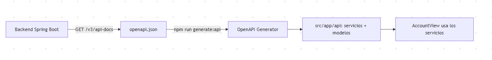
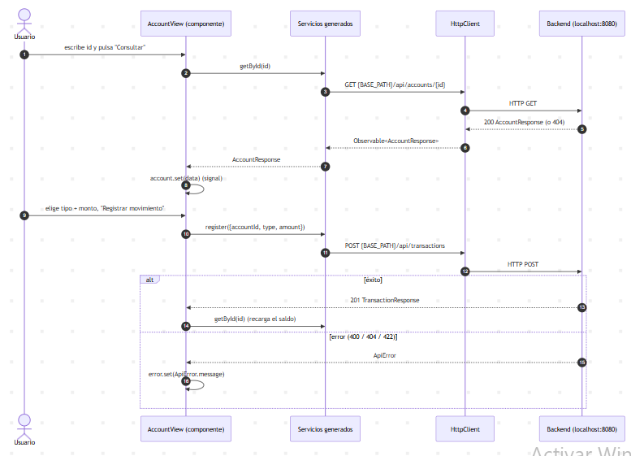

# Frontend — Banca (Angular 21)

Cómo está organizada la app web y cómo se conecta con el backend.

## Visión general
- Angular 21 **standalone + signals** (app zoneless).
- El cliente HTTP se **genera** desde el contrato OpenAPI del backend (OpenAPI
  Generator), así los tipos del front no se desfasan de la API.
- El componente no conoce URLs ni `HttpClient`: usa los servicios generados.

## Estructura
```
src/app
├── api/        cliente generado (AccountsService, TransactionsService, modelos). No editar.
├── core/       api.config.ts -> URL del backend (BASE_PATH)
└── features/   account/ (componente: consulta + movimiento)
openapi.json    contrato del backend, entrada del generador
```

## Pipeline de generación del cliente



## Flujo en tiempo de ejecución



## Regenerar el cliente y cambiar la URL
- Regenerar: `npm run generate:api` (lee `openapi.json`; requiere Java 17).
- Refrescar el contrato: `curl http://localhost:8080/v3/api-docs > openapi.json`.
- URL del backend: un único sitio, `src/app/core/api.config.ts` (se inyecta como
  `BASE_PATH` en `src/app/app.config.ts`).
